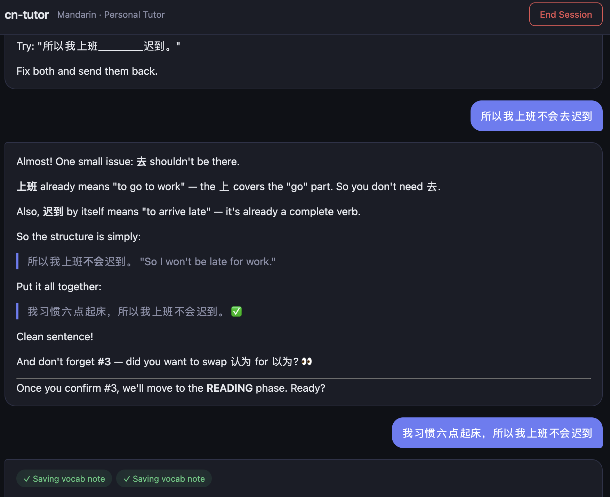

# cn-tutor

A personal Mandarin Chinese tutor powered by the Anthropic API. Delivers structured lessons, answers questions, creates Anki flashcards, and builds a persistent record of what you've studied — all in a local web app.



---

## What it does

**Lesson mode** — say "start a lesson" and the tutor runs a full structured class:

1. **Warmup** — recall drills on words from previous sessions
2. **Reading** — a short HSK 3-4 passage, labelled conversational or formal, with comprehension questions
3. **Grammar** — one concept explained in English, drilled in Chinese; the tutor requires attempts before corrections
4. **Writing practice** — prompts of escalating difficulty; no answer until you've tried
5. **Wrap-up** — summary of what was covered, new Anki cards to make, focus for next time

**Self-directed mode** — ask a grammar question, request conversation practice, or look something up. No forced structure; the tutor responds naturally.

In both modes the tutor pushes back. It won't hand over answers unprompted and will ask you to identify your own errors before explaining them.

**Chinese word highlighting** — every Chinese character sequence in the tutor's responses is segmented into individual words. Hover any word to see its pinyin and English definitions instantly, with no server round-trip.

**Anki integration** — the tutor checks AnkiConnect before creating cards (no duplicates), creates cards directly into your deck, syncs with AnkiWeb at the start of each session, and can refresh the vocabulary snapshot on demand.

**Session persistence** — vocab notes, grammar notes, and a session summary are written to markdown files at the end of each session. These feed back into the system prompt so each lesson builds on the last.

---

## Requirements

### Runtime
- **Node.js** 18+ (20+ recommended)
- **Anthropic API key** — [console.anthropic.com](https://console.anthropic.com)

### For Anki integration (optional but recommended)
- **Anki** desktop app running
- **AnkiConnect** add-on ([ankiweb.net/shared/info/2055492159](https://ankiweb.net/shared/info/2055492159)) — provides the local REST API at `http://localhost:8765`
- A deck named **`Chinese Vocabulary::NonHSK`** in Anki (or update `DECK_NAME` in `server/tools/anki.ts`)
- The **HSK** note type with fields: `Key, Simplified, Pinyin.1, Meaning, Part of speech, Audio, SentenceSimplified, SentencePinyin.1, SentenceMeaning, SentenceAudio`

The CC-CEDICT dictionary (`data/cedict_ts.u8`) is bundled in the repo — no external path required.

---

## Setup

```bash
# 1. Install dependencies
npm install

# 2. Copy the env template and fill in your values
cp .env.example .env
```

Edit `.env`:

```env
ANTHROPIC_API_KEY=sk-ant-...
ANKI_CONNECT_URL=http://localhost:8765   # default; only needed if non-standard
WEB_PORT=3001                            # default; only needed to change the port
```

---

## Running

```bash
# Development (hot-reload on both server and client)
npm run dev
```

Opens at **http://localhost:5173** (Vite dev server proxying API calls to Express on port 3001).

```bash
# Production build
npm run build
NODE_ENV=production node -r dotenv/config dist/server/index.js
```

---

## Vocabulary snapshot

The tutor's system prompt includes a snapshot of your Anki vocabulary — which words are confident, learning, or shaky. There are two ways to refresh it:

**During a session** — the tutor can call the `refresh_anki_snapshot` tool directly. Ask it to "refresh my vocabulary snapshot" or it will do so automatically when relevant.

**From the command line** — run the standalone script (requires `requests` and `python-dotenv`):

```bash
pip install requests python-dotenv
python scripts/get-learned-words.py
```

Both write to `progress/anki-snapshot.md` and use the same confidence thresholds: confident = interval ≥ 21 days + ease ≥ 2.5; shaky = interval < 7 days or ease < 2.0.

---

## Project structure

```
cn-tutor/
├── server/
│   ├── index.ts               # Express entry point; SSE chat, dictionary, beacon routes
│   ├── harness/
│   │   ├── session.ts         # In-memory session store (messages[], vocab/grammar notes)
│   │   ├── system-prompt.ts   # Builds the cached system prompt from context files
│   │   └── tool-loop.ts       # Core AI loop: stream → tools → stream until done
│   ├── tools/
│   │   ├── anki.ts            # AnkiConnect wrapper (sync, check, create, snapshot)
│   │   ├── dictionary.ts      # CC-CEDICT loader, word lookup, segmentation, gzip export
│   │   ├── session-tools.ts   # save_vocab_note, save_grammar_note, end_session
│   │   └── index.ts           # Tool registry and dispatcher
│   └── lib/
│       └── context.ts         # Loads Anki snapshot, grammar history, recent sessions
├── client/
│   ├── src/
│   │   ├── App.tsx            # Root layout
│   │   ├── App.css            # Dark theme
│   │   ├── components/
│   │   │   ├── Chat.tsx       # SSE streaming, session ID, tool event display
│   │   │   ├── Message.tsx    # Markdown render + Chinese segmentation + hover popup
│   │   │   └── SessionBar.tsx # Header with End Session button
│   │   └── lib/
│   │       └── dictionary.ts  # Browser-side CC-CEDICT: load once, segment + lookup locally
│   ├── index.html
│   └── vite.config.ts         # Dev proxy /api → localhost:3001
├── data/
│   └── cedict_ts.u8           # CC-CEDICT dictionary (bundled, ~9.4MB)
├── scripts/
│   └── get-learned-words.py   # CLI script to refresh progress/anki-snapshot.md
├── progress/
│   ├── anki-snapshot.md       # Generated by script or refresh_anki_snapshot tool
│   ├── vocab-history.md       # Appended after each session
│   ├── grammar-history.md     # Appended after each session
│   └── sessions/              # One markdown file per session (gitignored)
├── .env.example
├── package.json
├── tsconfig.json              # Root (client, bundler resolution)
└── tsconfig.server.json       # Server (Node, ESM)
```

---

## How it works

### AI harness

The core is a **stateful message loop** in `server/harness/tool-loop.ts`. Each conversation turn:

1. Appends the user message to `session.messages[]`
2. Calls `client.messages.stream()` with the full history, system prompt, and tool definitions
3. Streams text deltas to the browser via SSE as they arrive
4. On `stop_reason: "tool_use"` — executes every requested tool, appends results to messages, and loops back to step 2
5. On any other stop reason — sends `{type: "done"}` and exits

The loop runs entirely server-side; the browser just receives a stream of SSE events.

### System prompt and prompt caching

`buildSystemPrompt()` assembles a large context block containing:

- **Student profile** (level, study time, goals)
- **Anki vocabulary snapshot** — which words are confident, learning, or shaky
- **Grammar history** — concepts covered in past sessions
- **Recent session summaries** — last 3 sessions

This block is sent with `cache_control: {type: "ephemeral"}` so Anthropic caches it across turns (0.1× input cost on cache hits). A small volatile suffix with today's date is sent as a **separate, uncached** system block — this way the date changes daily without busting the vocabulary cache.

### Tools

| Tool | What it does |
|---|---|
| `lookup_word` | Looks up a word in the in-memory CC-CEDICT dictionary |
| `check_anki_card` | Queries AnkiConnect for an existing card and its study stats |
| `create_anki_card` | Creates a new card in the `Chinese Vocabulary::NonHSK` deck |
| `sync_anki` | Triggers an AnkiWeb sync via AnkiConnect |
| `refresh_anki_snapshot` | Fetches all cards from the deck, categorizes by confidence, and updates `progress/anki-snapshot.md` |
| `save_vocab_note` | Stores a vocab note on the session object for inclusion in the summary |
| `save_grammar_note` | Stores a grammar note; also appended to `grammar-history.md` at session end |
| `end_session` | Writes the session summary markdown file and appends to history files |

The tutor calls these proactively — checking for duplicates before creating cards, saving notes as the lesson progresses, and calling `end_session` at the end of a lesson's wrap-up phase.

### Session persistence

Sessions are stored in memory during a conversation (intentionally reset on server restart). At end-of-session, three things are written to disk:

- `progress/sessions/YYYY-MM-DD.md` — full session summary
- `progress/vocab-history.md` — vocab notes appended
- `progress/grammar-history.md` — grammar notes appended

If the browser window is closed without ending the session, `navigator.sendBeacon` fires a `POST /api/session-beacon` request that auto-saves any collected vocab/grammar notes as a partial record.

On next startup, the server reads these files and includes them in the system prompt, so the tutor has continuity across sessions.

### Browser-side dictionary

The CC-CEDICT dictionary (121k+ entries) is loaded into memory at server startup from `data/cedict_ts.u8`. On first page load, the browser fetches `GET /api/dictionary/all` — a pre-gzipped JSON blob (~3.5MB compressed) served with a 24-hour cache header. After that first load:

- **Segmentation** uses a longest-match algorithm (max 6 characters) to split Chinese text into individual words
- **Lookup** is a synchronous `Map.get()` call
- **No server round-trips** happen on hover

Every Chinese word in every assistant message gets its own hoverable `<span>`. Hovering shows the word's pinyin and up to three English definitions in a popup.

---

## Session workflow

```
Open app
  └── Browser fetches CC-CEDICT (~3.5MB, cached for 24h)

Send first message
  └── Session created (UUID)
  └── Anki snapshot + grammar history + recent sessions injected into system prompt (cached)

During lesson
  └── Tutor streams text via SSE
  └── Tool calls execute server-side (AnkiConnect, dictionary, note saving)
  └── Tool events shown in UI (⟳ running → ✓ done)
  └── Chinese words in responses are hoverable

End session
  ├── Manual: click "End Session" → sends end message → tutor calls end_session tool
  └── Auto: close window → sendBeacon saves partial notes

Next session
  └── Previous session summary, grammar history, updated vocab snapshot all in context
```

---

## Customising

**Student profile** — edit the profile block in `server/harness/system-prompt.ts` to match your level, goals, and native language.

**Lesson structure** — the five-phase lesson and core rules are defined in the `TUTOR_PERSONA` constant in the same file.

**Anki deck / note type** — update `DECK_NAME` and the field mapping in `server/tools/anki.ts`.

**Model** — the model is set in `server/harness/tool-loop.ts`. Currently uses `claude-opus-4-7`.
